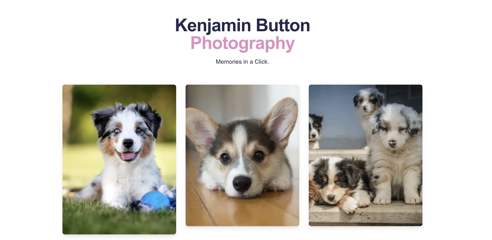

<div align="center">
  <h1>Kenjamin Button Photography</h1>

  <h3>A Modern Photography Portfolio & Blog</h3>

  <p align="center">
    <h2>
      <a href="https://photography-roan.vercel.app/" style="font-size: 24px;">
        📸 VIEW LIVE SITE 📸
      </a>
    </h2>
    <br />
    A sleek, modern photography portfolio and blog built with Next.js 15, featuring secure admin authentication,
    dynamic content management, and optimized image delivery through Cloudinary.
    <br />
    <a href="https://github.com/KenjaminButton/photography"><strong>Explore the docs »</strong></a>
    <br />
    <br />
    <a href="https://github.com/KenjaminButton/photography/issues">Report Bug</a>
    ·
    <a href="https://github.com/KenjaminButton/photography/issues">Request Feature</a>
  </p>
</div>

## About The Project

A modern, full-featured photography portfolio and blog platform. This project showcases a clean, responsive design with a focus on image presentation and content management. It features a secure admin dashboard for content creation, image optimization through Cloudinary, and a robust database system using Turso SQLite.

### Screenshots

<div align="center">
  <h3>Homepage Gallery</h3>
  
</div>

### Features

#### Content Management
* Secure admin dashboard
* Dynamic post creation and management
* Image upload and optimization
* Real-time content updates
* Rich text editing capabilities

#### User Interface
* Clean and modern design
* Responsive layout for all devices
* Optimized image loading
* Smooth transitions
* Intuitive navigation

#### Technical Features
* Next.js 15 App Router
* Server-side rendering
* Image optimization with Cloudinary
* Secure authentication with NextAuth.js
* SQLite database with Turso
* TypeScript for type safety
* Tailwind CSS for styling

### Built With

* 
* 
* 
* 

## Getting Started

To get a local copy up and running, follow these steps.

### Prerequisites

* Node.js 18+ and npm
* A Cloudinary account for image hosting
* A Turso account for database

### Installation

1. Clone the repo
   ```sh
   git clone https://github.com/KenjaminButton/photography.git
   ```
2. Install dependencies
   ```sh
   cd photography
   npm install
   ```
3. Set up environment variables in `.env.local`:
   ```
   # Authentication
   NEXTAUTH_SECRET=your_secure_secret
   NEXTAUTH_URL=http://localhost:3000
   ADMIN_EMAIL=your_admin_email
   ADMIN_PASSWORD=your_hashed_password

   # Cloudinary
   CLOUDINARY_CLOUD_NAME=your_cloud_name
   CLOUDINARY_API_KEY=your_api_key
   CLOUDINARY_API_SECRET=your_api_secret

   # Database
   DATABASE_URL=your_turso_database_url
   DATABASE_AUTH_TOKEN=your_turso_auth_token
   ```
4. Initialize the database
   ```sh
   npx tsx src/db/test-schema.ts
   ```
5. Start the development server
   ```sh
   npm run dev
   ```

## Deployment

The site is deployed on [Vercel](https://vercel.com/) at: [Photography Portfolio](https://photography-roan.vercel.app/)

Features:
* Automatic HTTPS
* Global CDN
* Serverless Functions
* Edge Network
* Zero-configuration deployment

## Roadmap

### Phase 1: Core Features 
- [x] Next.js 15 setup
- [x] Responsive design
- [x] Image optimization
- [x] Admin authentication
- [x] Database integration

### Phase 2: Content Management 
- [x] Post creation
- [x] Image uploads
- [x] Content editing
- [x] Post publishing
- [x] Admin dashboard

### Phase 3: Enhancements 
- [ ] Image galleries
- [ ] Categories and tags
- [ ] Search functionality
- [ ] Post comments
- [ ] Social sharing

See the [open issues](https://github.com/KenjaminButton/photography/issues) for proposed features and known issues.

## Contributing

Contributions make the open source community amazing! Any contributions you make are greatly appreciated.

1. Fork the Project
2. Create your Feature Branch (`git checkout -b feature/AmazingFeature`)
3. Commit your Changes (`git commit -m 'Add some AmazingFeature'`)
4. Push to the Branch (`git push origin feature/AmazingFeature`)
5. Open a Pull Request

## License

Distributed under the MIT License. See `LICENSE` for more information.

## Contact

Kenneth Chang - [@KenjaminButton](https://kenjaminbutton.com/contact)

Project Link: [https://github.com/KenjaminButton/photography](https://github.com/KenjaminButton/photography)

## Acknowledgments

* [Next.js](https://nextjs.org/) - The React Framework
* [Cloudinary](https://cloudinary.com/) - Image Management
* [Turso](https://turso.tech/) - SQLite Database
* [Vercel](https://vercel.com/) - Deployment Platform